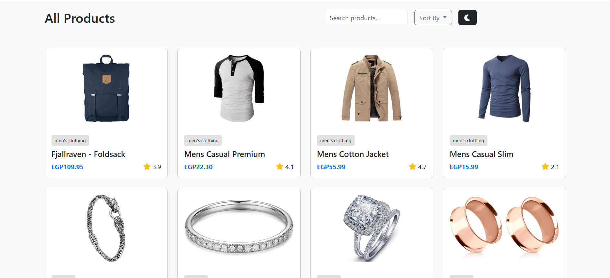
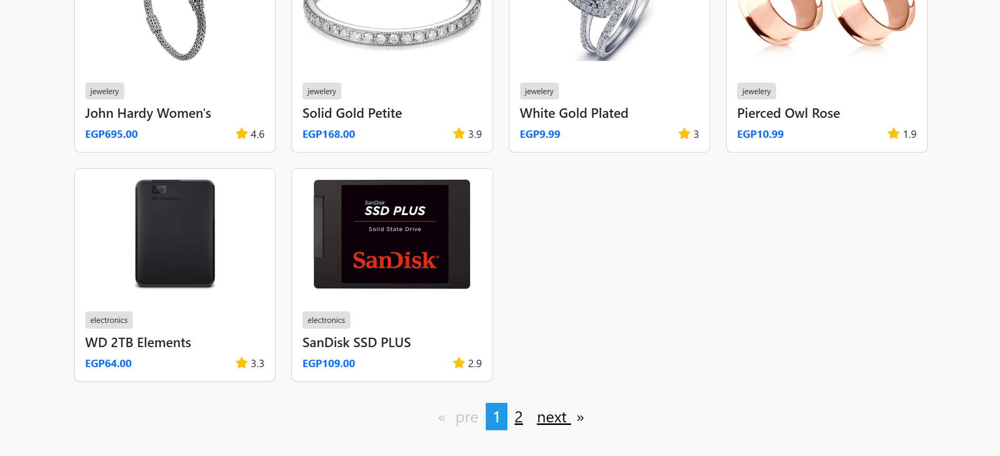
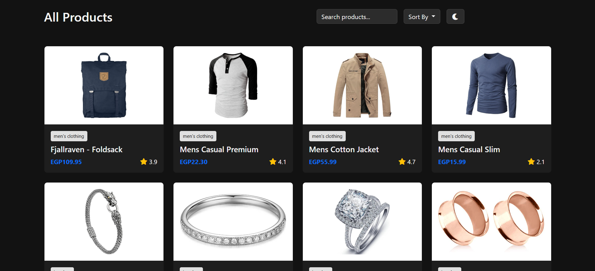
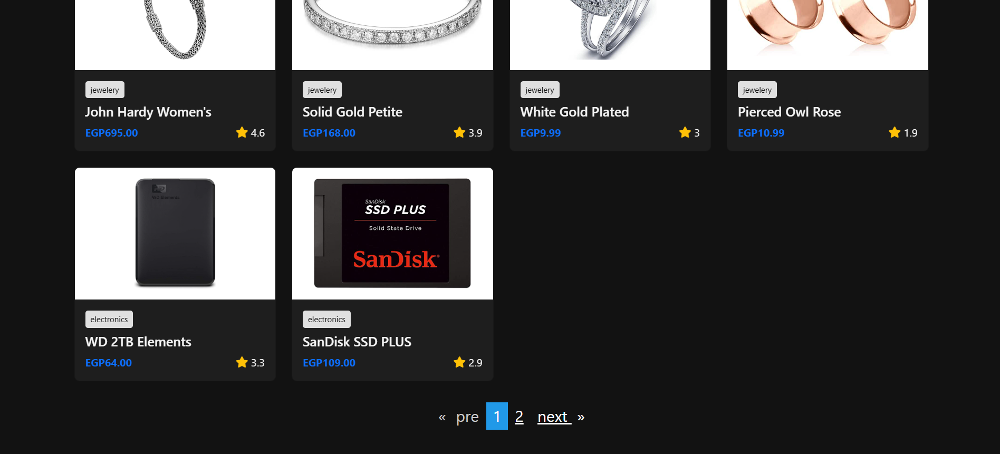
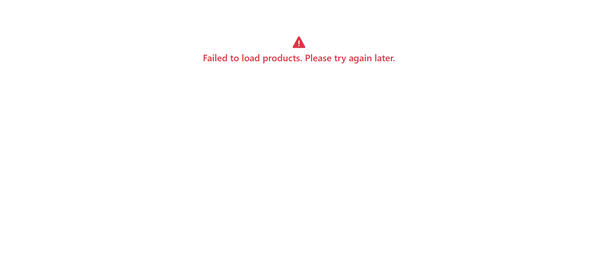
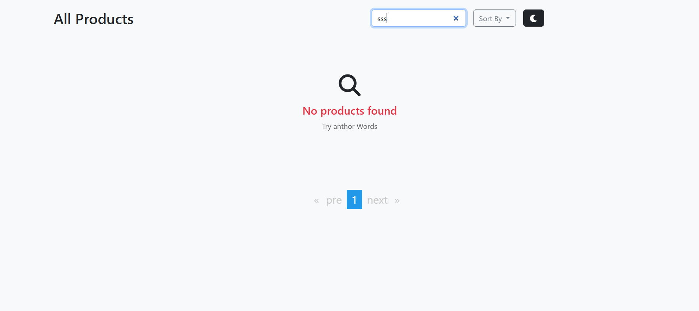

# 📘 Route Task

ِA product listing application built with Angular 18 . It fetches products from an API and allows users to search, sort, and paginate through them. The app also supports light and dark mode.

---

## 🧱 Tech Stack used

- **Angular 18**
- **Bootstrap 5**
- **Font Awesome**
- **ngx-pagination**
- **ngx-spinner**


## 🚀 Features

- 🌐 Client-side Routing
- 🌙 Dark Mode Toggle
- 🔄 Loading Spinner with Delay
- 🔍 Search & Sort Functionality
- 📃 Pagination
- 📱 Fully Responsive UI

---

## 📸 Screenshots

### 🌞 Light Mode



### 🌙 Dark Mode



### Error Handling



---

## 🔧 How to Run Locally

```bash
git clone https://github.com/HamzaAshraf16/Route-Task.git
cd Route-Task
npm install
ng serve
